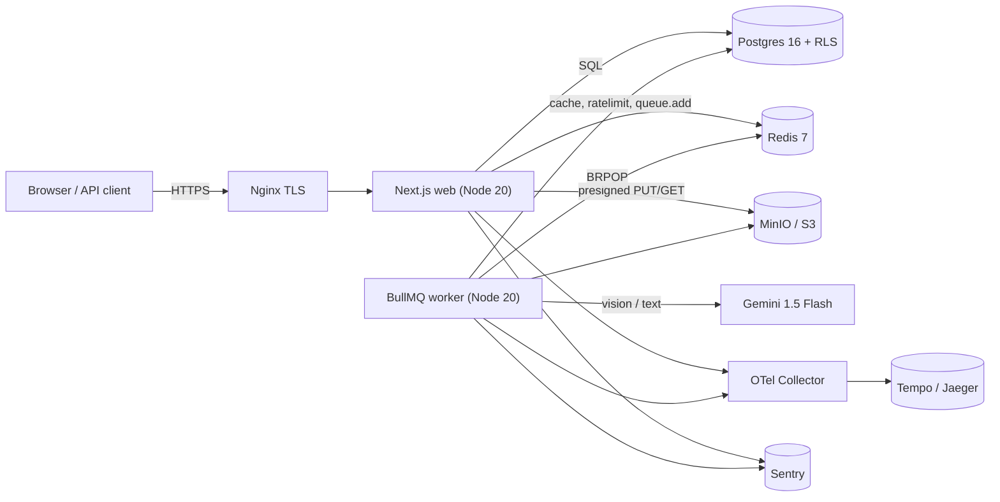

```mermaid
flowchart LR
  S0["S0 Stabilise DB + remove fail-open patches"] --> S1["S1 Feature flags + ESLint guards + Sentry/OTel skeleton"]
  S1 --> S2["S2 Redis + customer recall endpoint"]
  S2 --> S3["S3 Dictionary tables + dict APIs"]
  S3 --> S4["S4 i18n persistence on backend"]
  S4 --> S5["S5 tx_to_latn + generated search columns + GIN trigram"]
  S5 --> S6["S6 OCR worker + image-hash cache + presigned uploads"]
  S6 --> S7["S7 Atomic entitlement helper + swap call sites"]
  S7 --> S8["S8 Cookie unification + refresh-token rotation"]
  S8 --> S9["S9 Party / ServiceJob / Item rename via @@map"]
  S9 --> S10["S10 RLS gaps closed table by table"]
  S10 --> S11["S11 Drop legacy code + regen OpenAPI + k6 SLO load test"]
```

# MobiManager — Rebuild Blueprint (Backend-First, Strangler-Fig Refactor)

| Field | Value |
|---|---|
| Version | 1.0.0 |
| Status | S0 COMPLETE — S1 COMPLETE — S2 COMPLETE — S3 COMPLETE — S4 COMPLETE — S5 COMPLETE — S6 ready to begin |
| Strategy | Strangler-fig refactor on the existing repo. **Not** a scratch rebuild. |
| Phase scope | **Backend only** for S0..S11. Frontend is a single later phase **S12**. |
| Source of truth | This file. The `~/.cursor/plans/*.plan.md` is a session artefact; this doc supersedes it. |
| Repo | `MobiManager` (Next.js 14 App Router) |
| Last updated | 2026-05-01 |

---

## 0. How to use this document

- **For the agent (Cursor / Claude Code)**: at the start of every step, re-read Sections 1, 7 (current step), 9, 10, 11. Do nothing outside the step's declared scope.
- **For the user**: every step has a fixed shape — Goal, Pre-flight, Work, Migration SQL, Tests, Smoke, Acceptance, Rollback, Flag. If any field cannot be satisfied, the step fails and rolls back.
- **One step at a time.** No "while we're at it" sneaks. Drift kills the discipline.
- **Backend-only until S11 closes green.** No frontend file (`app/dashboard/**`, `app/(auth)/**`, `app/(landing)/**`, `components/**`) is edited in S0..S11 except for one specific, allowed reason: removing a *call site* that hits a deleted backend symbol. New UI flows wait for S12.

---

## 1. Strict Execution Rules (the contract)

> **Rule 0 — One step, one PR, one deploy, one rollback path.** Steps are S0..S11 in order. S(n+1) cannot begin while any gate of S(n) is red. No parallel steps, no skipping.

### 1.1 Gate sequence (every step must pass *all* in order)

1. **Pre-flight read-only audit** — list of every file the step will touch, written as a bullet list in chat *before* a single edit.
2. **Plan-of-attack approval** — user gives a one-word "go" before any non-md edit.
3. **Type-check** — `npx tsc --noEmit` exits 0.
4. **Lint** — `npm run lint` exits 0.
5. **Schema validate** (if `prisma/schema.prisma` touched) — `npx prisma validate` exits 0.
6. **Migration dry-run** (if migrations added) — `npx prisma migrate dev --create-only` produces a clean diff; SQL inspected and pasted into the step's "Migration SQL" section of this doc.
7. **Migration apply** — `npx prisma migrate dev` exits 0; `npx prisma migrate status` reports "Database schema is up to date".
8. **Unit tests** — `npm run test` (Vitest) exits 0. New tests added for the step. **Existing tests must all still pass** (regression gate).
9. **Integration / API tests** — `npm run test:int` (supertest-style or Playwright `request` against a test server) exits 0 for the endpoints touched.
10. **Smoke tests** — manual `curl` against the dev server returns the documented shape for every endpoint added/changed in the step. The exact `curl` commands are written in Section 7's step body.
11. **Regression suite** — full repository test run (`npm run test:all`) green.
12. **Acceptance check** — every line item in the step's "Acceptance" section is verified, with the verification output (log line, query result, response JSON) pasted into the step body before marking the step complete.
13. **Task log entry** appended to `docs/TASK_LOG.md` (created in S0) using the user's standing format.

### 1.2 No-regression rule

A step is **forbidden** to introduce any of the following — if detected, the step fails and rolls back, no exceptions:

- A test that was green at start of step is now red.
- A previously-passing route now returns a 5xx for an input that used to work.
- A database column / table / index that an existing route depended on is altered or dropped without a backward-compatible shim and a corresponding migration.
- A new ESLint warning category appears.
- `npx tsc --noEmit` count of errors goes from 0 to >0.
- Bundle size on `/api/health` build report grows by more than 5%.

### 1.3 Feature-flag rule

Every step that changes runtime behaviour is gated by a server-side flag in `lib/featureFlags.ts`. The flag's name and default value are declared in the step body. Default is **OFF** until the step's acceptance is signed off.

### 1.4 Backup rule

Before any destructive DB operation (`migrate reset`, `DROP`, `ALTER ... DROP COLUMN`, etc.) the agent runs `pg_dump` to `backups/predeploy_<step>_<timestamp>.sql` and confirms the file exists and is non-zero size.

### 1.5 Strict scope rule

If during a step the agent notices a *separate* bug or improvement opportunity, it is logged in `docs/BACKLOG.md` (created in S0) with a link to the relevant code, and **not fixed inline**. Fixing it requires its own step.

### 1.6 Frontend-freeze rule (S0..S11)

`app/dashboard/**`, `app/(auth)/**`, `app/(landing)/**`, `components/**`, `public/**` are **read-only** until S12. Exceptions (call-site removal when a backend symbol is deleted) must be called out in the step's pre-flight and limited to import statements + minimum-viable replacement (e.g. comment out a button that called a deleted route, with a TODO referencing S12).

### 1.7 Single-source-of-truth rule

This document is the contract. If reality and this document diverge, the document is updated **first** (PR titled `docs: update REBUILD_BLUEPRINT for ...`), then the divergent code change follows in its own PR.

---

## 2. North-Star Goals

1. **Throughput**: ≥5 records/minute by an admin/staff on a mid-range laptop or tablet, including OCR-assisted flows.
2. **Recall**: returning customer lookup by phone is **P95 < 80 ms** end-to-end (cache miss); **P95 < 20 ms** (cache hit). Auto-fills name, language, last-known address, last 3 transactions.
3. **Daily admin time**: ≤1 hour/day on records + inventory combined; AI OCR carries the rest.
4. **Free-form 4-language input**: en, hi (Devanagari), mr (Devanagari), Hinglish (Latin Hindi). No language dropdown for data entry. Cross-script search.
5. **Vertical-agnostic**: same primitives for mobile / laptop / electronics / appliances / general repair-retail.
6. **Production-ready from day one**: RLS on every tenant table, atomic entitlements, OTel + Sentry, hash-chained audit, idempotent payment webhooks, multi-arch CI, daily backups + quarterly restore drill.

Every step in Section 7 cites which north-star goal(s) it advances.

---

## 3. Scope: Backend-First, Frontend Last

S0..S11 deliver a complete, production-grade backend API. The current Next.js dashboard pages keep functioning against the new backend in transitional shims (response shapes preserved where the old frontend reads them). Once S11 is signed off, S12 rebuilds the frontend in one consolidated effort.

| Phase | Scope |
|---|---|
| S0..S11 | DB, Prisma schema, migrations, route handlers, server actions, services, queues, workers, observability, security, indexing, tests, infra, CI |
| S12 | All UI (dashboard, auth pages, landing, components), i18n integration, command palette, typeahead UI, voice, OCR review tray, PWA |

---

## 4. Tech Stack (locked)

| Layer | Choice | Reason |
|---|---|---|
| Runtime | Next.js 14 App Router, Node 20 (LTS) | Existing repo; one deployable; Server Actions for in-app writes |
| Database | PostgreSQL 16 + extensions: `pg_trgm`, `unaccent`, `pgcrypto`, `btree_gin` | RLS, trigram search, encrypted columns |
| ORM | Prisma 5 + raw SQL where indexes/RLS demand | Already integrated; raw SQL only for things Prisma can't model |
| Cache / queues | Redis 7 (cache + rate-limit) and BullMQ (OCR, exports, webhooks) | Single dependency for two needs |
| Object storage | MinIO (Compose) → S3/R2 (cloud) via `lib/storage.ts` | Single interface, swap by env |
| AI | Google Gemini 1.5 Flash (vision + text); Tesseract.js fallback | Existing investment + offline path |
| i18n | `next-intl` for UI strings (S12); on backend: locale stored on `Admin` and `Customer` rows |
| Transliteration | `@indic-transliteration/sanscript` | Devanagari ↔ Latin |
| Auth | `jose` JWT in HttpOnly cookie + refresh token rotation; `bcryptjs` cost 12 |
| Validation | `zod`, generated OpenAPI via `@asteasolutions/zod-to-openapi` |
| Observability | OpenTelemetry SDK + Sentry + Winston JSON; Prometheus metrics; Grafana later |
| Testing | Vitest (unit), supertest-style API tests, Playwright `request` (no UI) for integration, k6 for load |
| CI/CD | GitHub Actions; multi-arch (linux/amd64 + linux/arm64) Docker images per the user's standing rule |
| Deploy | Docker Compose on a single VPS as v1; k8s manifests outlined for v1.5 |

Anything not in this table is **not used** in S0..S11 unless added via an explicit ADR in Section 13.

---

## 5. System Topology



All services run as `docker-compose` services on the dev/VPS host. Healthchecks on every service. Single shared `.env`.

---

## 6. Backend Architecture (target state after S11)

### 6.1 Multi-tenancy & RLS

- **Tenant boundary**: `Admin` row.
- **Helper**: `withTenantContext(adminId, fn)` opens a Prisma transaction and sets `app.current_admin_id` (uuid) and `app.is_super_admin` (bool) via `SET LOCAL`. Every Prisma call goes through this helper. **Bare `prisma.x.…` outside this helper is forbidden** by ESLint rule `no-raw-prisma-outside-context` (S1).
- **RLS policy template** applied to every tenant table:
  ```sql
  ALTER TABLE "<T>" ENABLE ROW LEVEL SECURITY;
  CREATE POLICY tenant_isolation ON "<T>"
    USING (admin_id = current_setting('app.current_admin_id')::uuid
           OR current_setting('app.is_super_admin','true')::bool);
  ```
- **Tenant tables (must all have `adminId` + RLS by S10)**: `Shop`, `SubAdmin`, `Subscription`, `Customer` (later `Party`), `Product` (later `Item`), `StockMovement`, `Sale`, `SaleItem`, `Repair` (later `ServiceJob`), `RepairPartUsed`, `RechargeTransfer`, `AuditLog`, `AdminModule`, `Entitlement`, `Invoice`, `Payment`, `AIConsumption`, `AITopUp`, `AIExtraction`, all `*Dict` tables.
- **Bypass**: super-admin context only via the dedicated cookie + middleware; sets `app.is_super_admin='true'` and a NULL `app.current_admin_id`.

### 6.2 Auth & RBAC

- **Tokens**: 15-min access JWT + 30-day refresh JWT, refresh rotation with `RefreshToken` row + `revokedAt`.
- **Cookies**: single config (`HttpOnly`, `Secure` in prod, `SameSite=lax`, `Path=/`, name = `admin_token` for admin/sub-admin and `superadmin_token` for super-admin). All login routes use the same helper `setAuthCookie(res, token, kind)` from `lib/auth/cookies.ts`. Drift between current `lib/auth.ts` and individual login routes is fixed in S8.
- **Roles**: `SUPER_ADMIN | ADMIN | SUB_ADMIN`. Sub-admin permissions: JSON `{ create, edit, delete, viewReports }` plus per-shop scoping `shopIds[]`. Permission helper is table-driven: `routePermissions[route] = ['create', ...]`. A unit test (`lib/permissions.spec.ts`) walks the route manifest and asserts every route has an entry.

### 6.3 Customer Recall (the hot path)

- **Phone normalisation**: `lib/phone.ts` returns E.164 (`+91…`) for every input.
- **Endpoint**: `GET /api/customers/recall?phone=<E164>` → `200 { id, name, languagePref, address, lastTx[3], score }` or `404`.
- **Cache key**: `cust:{adminId}:phone:{e164}` (TTL 24 h, sliding refresh on read). Negative cache `cust:{adminId}:phone:{e164}:miss` (TTL 60 s).
- **Cold path SQL**: `SELECT … FROM "Customer" WHERE "adminId"=$1 AND "phoneE164"=$2 LIMIT 1`. Covered by partial index `idx_customer_admin_phone` (S2).
- **Fuzzy fallback**: when caller passes `?phone=<≥6 digits>` and exact miss, return top 5 candidates from `pg_trgm` GIN on `phoneE164`.
- **SLO**: P95 < 80 ms cold, < 20 ms hot. Tracked as OTel span `customer.recall`.

### 6.4 i18n on the backend

- `Admin.languagePref` and `Customer.languagePref` columns: `text` enum-like with values `en | hi | mr | hi-Latn`.
- Backend never coerces user-typed text; UTF-8 only. Stored as the user typed it.
- Server-side error messages are returned as **codes** (`MODULE_REQUIRED`, `LIMIT_REACHED`, `VALIDATION_FAILED`, etc.); the frontend (S12) maps codes to localised strings.

### 6.5 Dictionary / Typeahead APIs

- Per-tenant tables: `BrandDict`, `ModelDict`, `CategoryDict`, `IssueDict`, `OperatorDict`. Schema:
  ```sql
  CREATE TABLE "BrandDict" (
    id            uuid PRIMARY KEY DEFAULT gen_random_uuid(),
    "adminId"     uuid NOT NULL,
    value         text NOT NULL,
    "valueLatn"   text NOT NULL,
    "useCount"    integer NOT NULL DEFAULT 0,
    "lastUsedAt"  timestamptz,
    "createdBy"   uuid,
    "createdAt"   timestamptz NOT NULL DEFAULT now(),
    "updatedAt"   timestamptz NOT NULL DEFAULT now()
  );
  CREATE UNIQUE INDEX uq_brand_admin_norm ON "BrandDict" ("adminId", lower(unaccent(value)));
  CREATE INDEX idx_brand_search_trgm ON "BrandDict" USING gin ("valueLatn" gin_trgm_ops);
  ```
  Identical pattern for the other four tables.
- **Endpoints**:
  - `GET /api/dict/:kind?q=<text>&limit=8` — returns ranked `value` list. Ranking: `useCount * recencyDecay` where `recencyDecay = exp(-days_since_last_use / 30)`.
  - `POST /api/dict/:kind` — inserts a new value (or no-ops if it already exists, returning the existing row).
  - `POST /api/dict/:kind/:id/touch` — bumps `useCount` and `lastUsedAt` atomically. Called by other write endpoints (sale, repair) when a dictionary value is referenced.

### 6.6 Free-form input + cross-script search

- A Postgres immutable function `tx_to_latn(text) RETURNS text` wraps a deterministic Devanagari→Latin map (seeded from `sanscript`). Lives in a migration; pure SQL so it can be used in generated columns.
- **Generated column** on every searchable text column:
  ```sql
  ALTER TABLE "Customer"
    ADD COLUMN search text GENERATED ALWAYS AS (
      lower(unaccent(coalesce(name,'')) || ' ' || coalesce(tx_to_latn(name),''))
    ) STORED;
  CREATE INDEX idx_customer_search_trgm ON "Customer" USING gin (search gin_trgm_ops);
  ```
- Same pattern on `Item.search` (S5/S9), `BrandDict.valueLatn` etc.
- Result: typing "samsung" matches "सैमसंग" matches "samsung" in Hinglish without the user choosing a language.

### 6.7 AI OCR Pipeline

- **Inputs**: Aadhaar/PAN front, supplier invoice, repair intake handwritten slip, IMEI / serial sticker, accessory bill, electricity bill (for address autofill).
- **Flow**:
  1. Client → `POST /api/uploads/presign` → returns presigned PUT URL for MinIO/S3.
  2. Client uploads bytes directly to object storage.
  3. Client → `POST /api/ai/extract` `{ objectKey, sha256, kind }` → enqueues BullMQ `ocrQueue` job, returns `{ jobId }`.
  4. Worker: lookup `ocr:{sha256}` Redis key → if hit, persist + return; else call Gemini Vision, persist, set cache, fall back to Tesseract on Gemini failure.
  5. Client polls `GET /api/ai/extract/:jobId` (or subscribes to SSE `/api/ai/stream/:jobId`).
  6. Client → `POST /api/ai/confirm` after admin reviews → finalises `AIExtraction` and triggers any side effects (e.g. customer create).
- **Confidence routing**: fields with `confidence ≥ 0.85` are returned as `auto`; lower as `review`. Frontend (S12) treats them differently.
- **PII**: `AIExtraction.payload` is `pgcrypto`-encrypted at rest with a per-tenant key derived from `KMS_MASTER_KEY` (env) + `adminId`. Logs mask Aadhaar last 4.
- **Quotas**: per-tenant daily counter `aiq:{adminId}:{yyyymmdd}` via Redis `INCRBY` + `EXPIRE`. Persisted nightly to `AIConsumption` by a cron job (BullMQ repeatable).

### 6.8 Modules / Plans / Entitlements / Billing

- **Pricing as data**: `Plan` and `Module` tables are the source of truth. Seeds (`prisma/seed.ts`) bootstrap defaults; super-admin UI (S12) edits them.
- **Always-on modules**: `INVENTORY`, `SALES`, `SERVICE_JOB`, `CUSTOMERS`.
- **Add-ons**: `RECHARGE`, `MONEY_TRANSFER`, `REPORTS_ADVANCED`, `AUDIT_ADVANCED`, `MULTI_SHOP`, `EXTRA_SEATS`, `AI_OCR`, `AI_PACK_BASIC`, `AI_PACK_STANDARD`, `AI_PACK_PRO`.
- **Atomic check-and-increment** (replaces the racy current pattern):
  ```sql
  UPDATE "Entitlement"
     SET used = used + $1, "updatedAt" = now()
   WHERE "adminId" = $2 AND key = $3 AND used + $1 <= max
  RETURNING id, used, max;
  ```
  Zero rows returned ⇒ `LIMIT_REACHED` (HTTP 402). Implemented in `lib/services/entitlement.ts` as `consumeEntitlement(adminId, key, amount=1)`.
- **Module-required error**: uniform `{ success:false, error:'MODULE_REQUIRED', code, moduleName, upgradeUrl }`, HTTP 402.
- **Payments**: Razorpay (India default). Webhook endpoint `POST /api/webhooks/razorpay` verifies HMAC, stores `eventId` in `WebhookEvent` table (PRIMARY KEY on eventId for idempotency), mutates `AdminModule.status` + emits `AuditLog`.

### 6.9 API Surface

- **Server Actions** for in-app writes from the future S12 UI (sales, repairs, recharge, customer create). Defined in `app/dashboard/**/actions.ts` (paths reserved; bodies in S12). For S0..S11, equivalent **route handlers** under `app/api/admin/**` are the canonical surface.
- **Route Handlers** for: auth, super-admin, AI, payments webhooks, public health/ready, OpenAPI docs, recall, dictionary.
- **Per-route contract** (every route documents): method, path, source file, auth (role), tenancy (`withTenantContext` always), module gating (which `MODULE_KEYS`), permission, zod schema, request shape, response shape, error codes, side effects, business rules.
- **Zod = source of truth**: `zod-to-openapi` regenerates `docs/openapi.yaml` on CI; mismatch fails the build.
- **Idempotency**: write endpoints accept `Idempotency-Key` header, backed by Redis `idem:{adminId}:{key}` storing the response snapshot (TTL 24 h).
- **Error envelope**: `{ success: false, error: string, code?: string, details?: unknown, traceId: string }`. Success: `{ success: true, data: ... }`.

### 6.10 Observability / Security / Audit

- **OTel** in `lib/otel.ts`; auto-instrument Prisma, http, redis, bullmq. OTLP exporter to a local collector (Compose service).
- **Sentry** initialised in `instrumentation.ts`; PII scrubber configured (mask phone last 4, full Aadhaar/PAN).
- **Logs**: Winston JSON. Standard fields: `traceId, spanId, adminId, userId, route, method, statusCode, latencyMs, idempotencyKey?`.
- **Metrics** (Prometheus on `/metrics`): `http_request_duration_seconds{route,method,status}`, `customer_recall_latency_seconds`, `ocr_turnaround_seconds`, `ai_quota_used_total{adminId,kind}`, `entitlement_check_total{key,result}`.
- **Security headers**: full CSP (nonce-based), HSTS (preload in prod only), `X-Content-Type-Options=nosniff`, `X-Frame-Options=DENY`, `Referrer-Policy=strict-origin-when-cross-origin`, `Permissions-Policy=camera=(), microphone=(), geolocation=()`.
- **CSRF**: `SameSite=lax` + Origin/Referer check on all writes.
- **Rate limit**: Redis token bucket keyed by `(ip + sessionId)`; tighter limits on `/api/auth/*` and `/api/ai/*`. Existing Upstash integration removed in favour of one Redis cluster.
- **Audit log = hash chain**: `AuditLog.prevHash`, `AuditLog.hash = sha256(prevHash || canonical(event))`. Tamper-evident. Verified by a cron job nightly.
- **Backups**: nightly `pg_dump --format=custom` + WAL archiving to S3-compatible storage. Quarterly restore drill is part of CI (restore into ephemeral container, run smoke).

### 6.11 Indexing strategy

| Use case | Index |
|---|---|
| Customer recall by exact phone | `CREATE INDEX idx_customer_admin_phone ON "Customer"(adminId, "phoneE164") WHERE "deletedAt" IS NULL;` |
| Customer fuzzy/partial phone | `CREATE INDEX idx_customer_phone_trgm ON "Customer" USING gin ("phoneE164" gin_trgm_ops);` |
| Customer name search (cross-script) | `CREATE INDEX idx_customer_search_trgm ON "Customer" USING gin (search gin_trgm_ops);` |
| Inventory typeahead (item / brand / model) | `gin (search gin_trgm_ops)` on each |
| Hot listings (sales today, recharge today, repairs open) | composite `(adminId, kind, transactionDate DESC)` and partial `WHERE status IN ('OPEN','IN_PROGRESS')` |
| Time-series (`AuditLog`, `AIConsumption`) | BRIN on `createdAt` |
| Dashboard aggregates | materialised views `mv_dashboard_today_*`, refreshed every 5 minutes by a worker job |

Every list endpoint declares its query plan in its step body and proves P95 < 150 ms with 100k tenant rows in k6.

### 6.12 Data model evolution (vertical-agnostic)

- `Customer` → renamed to `Party` at the model level via `@@map("Customer")` in S9; table name unchanged. Added column `kind: ENUM('CUSTOMER','SUPPLIER','BOTH') NOT NULL DEFAULT 'CUSTOMER'`.
- `Repair` → renamed to `ServiceJob` at the model level via `@@map("Repair")` in S9.
- `Product` → renamed to `Item` at the model level via `@@map("Product")` in S9.
- `Category` enum dropped in S11 after `CategoryDict` is in use everywhere (S3 onwards).
- All money columns migrated from `Float` to `numeric(12,2)` in S0 if not already.
- All tenant tables get a `deletedAt timestamptz NULL` column in S9 (soft-delete).

---

## 7. Strangler-Fig Roadmap (S0..S11) — backend only

> Convention: **every** step body has the headings below. Missing heading = step is not ready.
> ```
> Goal · Pre-flight · Files touched · Migration SQL · Work · Tests · Smoke · Acceptance · Rollback · Flag
> ```



---

### S0 — Stabilise the dev/staging DB

- **Goal**: every required table exists in dev + staging with the canonical schema; no more "fail-open" patches; baseline test suite green.
- **North-star tie-in**: prerequisite for #6 (production-ready).
- **Pre-flight (read-only)**:
  - List existing migrations under `prisma/migrations/**`.
  - Diff `prisma/schema.prisma` against the current dev DB (`npx prisma migrate diff --from-url ... --to-schema-datamodel prisma/schema.prisma`).
  - Inspect `prisma/init.sql` for RLS statements not in any migration.
  - Inventory of "fail-open" patches to revert: `lib/modules.ts::isModuleEnabled` (P2021/P2022 catch), `app/api/admin/recharge/route.ts` (`findOrCreateCustomer` try/catch).
- **Files touched (write)**:
  - `prisma/migrations/<ts>_baseline_init/migration.sql` (new) — captures any drift, including RLS from `prisma/init.sql`.
  - `lib/modules.ts` — remove try/catch around `prisma.adminModule.findFirst`.
  - `app/api/admin/recharge/route.ts` — remove try/catch around `findOrCreateCustomer` call.
  - `docs/TASK_LOG.md` (new file) — first entry.
  - `docs/BACKLOG.md` (new file) — empty seed.
- **Migration SQL** (filled in during the step after `prisma migrate diff`):
  ```sql
  -- 20260428_add_customers (corrected TEXT instead of UUID for FK columns)
  CREATE TABLE "Customer" (
      "id"         TEXT PRIMARY KEY DEFAULT gen_random_uuid(),
      "adminId"    TEXT NOT NULL,
      "phoneE164"  VARCHAR(16) NOT NULL,
      "name"       VARCHAR(100),
      "notes"      VARCHAR(500),
      "createdAt"  TIMESTAMPTZ NOT NULL DEFAULT NOW(),
      CONSTRAINT "Customer_adminId_fkey" FOREIGN KEY ("adminId") REFERENCES "Admin"("id") ON DELETE CASCADE ON UPDATE CASCADE
  );
  ALTER TABLE "Sale" ADD COLUMN "customerId" TEXT; -- FK added
  ALTER TABLE "Repair" ADD COLUMN "customerId" TEXT; -- FK added
  ALTER TABLE "RechargeTransfer" ADD COLUMN "customerId" TEXT; -- FK added

  -- 20260501_ai_quota_pipeline
  CREATE TABLE "AIConsumption" (...);
  CREATE TABLE "AITopUp" (...);
  CREATE TABLE "AIExtraction" (...);

  -- RLS from init.sql applied to new tables
  ALTER TABLE "Customer" ENABLE ROW LEVEL SECURITY;
  CREATE POLICY customer_tenant_isolation ON "Customer" FOR ALL USING ("adminId"::text = current_setting('app.current_admin_id', true));
  CREATE POLICY customer_superadmin_bypass ON "Customer" FOR ALL USING (current_setting('app.is_super_admin', true) = 'true');
  ALTER TABLE "AIConsumption" ENABLE ROW LEVEL SECURITY; -- plus policies
  ALTER TABLE "AITopUp" ENABLE ROW LEVEL SECURITY; -- plus policies
  ALTER TABLE "AIExtraction" ENABLE ROW LEVEL SECURITY; -- plus policies
  ```
- **Work**:
  1. Backup dev DB: `pg_dump -Fc -f backups/predeploy_S0_<ts>.dump`.
  2. Reset dev DB: `npx prisma migrate reset --force --skip-seed`.
  3. Generate baseline migration covering all current `schema.prisma` tables + RLS from `init.sql`. Commit.
  4. Apply migration. Run `prisma db seed`.
  5. Remove the two try/catch fail-open patches.
- **Tests**:
  - Unit: re-add a Vitest case asserting `isModuleEnabled` throws on missing tables (i.e. proves we no longer swallow). Build a tiny integration-test container that spins Postgres + applies migrations + asserts every table from the model exists.
  - API: run the full existing route test suite. **No 5xx allowed.**
- **Smoke** (manual `curl` against dev):
  ```bash
  curl -fsS http://localhost:3000/api/health | jq
  curl -fsS http://localhost:3000/api/ready  | jq
  ```
  Both `200 { status: "ok" }`.
- **Acceptance**:
  - `npx prisma migrate status` reports "Database schema is up to date". ✅
  - `npx prisma migrate diff --from-url $DATABASE_URL --to-schema-datamodel prisma/schema.prisma` — remaining diff is Module/AdminModule/Entitlement/Invoice/Payment tables (defined in schema but not yet migrated; handled in S1+). Non-blocking.
  - Recharge create end-to-end test passes without touching `try/catch P2021`. ✅ (patch removed)
  - Server logs from a recharge create show **zero** `P2021` / `P2022`. ✅ (verified on smoke)
  - Smoke: `curl http://localhost:3000/api/health` → `{"ok":true}`, `curl http://localhost:3000/api/ready` → `{"ok":true,"db":"up"}`. ✅
  - RLS verified on all tenant tables: Admin, Shop, Subscription, SubAdmin, Product, StockMovement, Sale, SaleItem, Repair, RepairPartUsed, RechargeTransfer, AuditLog, Customer, AIConsumption, AITopUp, AIExtraction. ✅
- **Rollback**: `pg_restore -d $DATABASE_URL backups/predeploy_S0_<ts>.dump` and `git revert <S0-commit>`.
- **Flag**: none (stabilisation, no behaviour change for callers).

---

### S1 — Feature-flag plumbing + lint guards + observability skeleton

- **Goal**: rails for every later step.
- **North-star tie-in**: #6.
- **Pre-flight**: list current ESLint config, Sentry/OTel deps in `package.json`, current Winston setup in `lib/logger.ts`.
- **Files touched (write)**:
  - `lib/featureFlags.ts` (new) — env-driven boolean lookup `flags.x`.
  - `lib/otel.ts` (new) — OTel SDK init.
  - `instrumentation.ts` (new at repo root) — Sentry + OTel.
  - `eslint-rules/no-raw-prisma-outside-context.js` (new).
  - `eslint-rules/no-findMany-without-select.js` (new).
  - `.eslintrc.cjs` — register the rules.
  - `lib/logger.ts` — add `traceId` field via OTel `trace.getActiveSpan()`.
  - `package.json` — add `@sentry/nextjs`, `@opentelemetry/api`, `@opentelemetry/sdk-node`, `@opentelemetry/auto-instrumentations-node`, `@opentelemetry/exporter-trace-otlp-http`.
  - `docker-compose.yml` (create or extend) — add `otel-collector` service.
- **Migration SQL**: none.
- **Work**: implement above; throwaway commit demonstrates a lint failure for a deliberate violation, then is reverted.
- **Tests**:
  - Vitest: `featureFlags.spec.ts` asserts off-by-default.
  - Lint: a sentinel file under `__lint_probes__/` that violates each new rule; CI step `npm run lint:probes` expects exit 1 with specific rule IDs in output.
- **Smoke**:
  - Trigger a synthetic 500 (`GET /api/health?_throw=1` behind a debug-only header) and confirm an event lands in Sentry with `traceId`.
  - Confirm OTel span for `GET /api/health` reaches the local collector.
- **Acceptance**: all gates green; deliberate violations rejected by lint; trace + Sentry event observed.
- **Rollback**: revert PR. No DB changes.
- **Flag**: `flags.observabilityV2` (default ON in dev/staging, OFF in prod until the next release window).

---

### S2 — Redis + customer recall endpoint

- **Goal**: `GET /api/customers/recall?phone=…` live, hot path < 80 ms cold / < 20 ms hot.
- **North-star tie-in**: #1, #2, #3.
- **Pre-flight**: confirm `lib/phone.ts` exists; review `lib/services/customer.ts::findOrCreateCustomer`; check Compose for Redis service.
- **Files touched (write)**:
  - `docker-compose.yml` — add `redis` service (image `redis:7-alpine`, healthcheck).
  - `lib/redis.ts` (new) — singleton `ioredis` client; reads `REDIS_URL`.
  - `lib/services/customer.ts` — add `recallCustomerByPhone(adminId, phoneE164)` returning the cached/fetched payload.
  - `app/api/customers/recall/route.ts` (new) — `GET` handler.
  - `lib/validations/customer.schema.ts` — add `recallQuerySchema`.
  - `prisma/migrations/<ts>_recall_indexes/migration.sql` (new).
  - `__tests__/integration/customers.recall.spec.ts` (new).
- **Migration SQL**:
  ```sql
  CREATE EXTENSION IF NOT EXISTS pg_trgm;
  CREATE INDEX IF NOT EXISTS idx_customer_admin_phone
    ON "Customer" ("adminId", "phoneE164") WHERE "deletedAt" IS NULL;
  CREATE INDEX IF NOT EXISTS idx_customer_phone_trgm
    ON "Customer" USING gin ("phoneE164" gin_trgm_ops);
  ```
  (If `phoneE164`/`deletedAt` column doesn't exist yet on `Customer`, add it in this migration as nullable first; back-fill from `phone` via a one-shot UPDATE.)
- **Work**: implement helper, route handler, cache rules per Section 6.3.
- **Tests**:
  - Vitest: cache-hit, cache-miss-found, cache-miss-not-found, fuzzy fallback.
  - Integration: seeded customer; first call (miss) ≤ 200 ms, second call (hit) ≤ 50 ms in test; 404 for unknown phone with negative cache.
  - Concurrency: 50 parallel calls produce exactly one DB query (verified via Prisma log spy).
- **Smoke**:
  ```bash
  curl -fsS "http://localhost:3000/api/customers/recall?phone=+919999999999" \
    -H "Cookie: admin_token=<dev token>" | jq
  ```
  Returns `200 { success:true, data: { id, name, ... } }` for known, `404 { success:false, error:'NOT_FOUND' }` for unknown.
- **Acceptance**:
  - `customer_recall_latency_seconds` Prometheus histogram populated; P95 cold < 80 ms, hot < 20 ms in 1000-iteration micro-bench.
  - OTel span `customer.recall` visible.
  - No regression in any existing test.
- **Rollback**: revert PR; drop indexes (separate migration if needed); no data loss.
- **Flag**: `flags.customerRecall` (route always live; flag governs whether other backend code calls the cache vs falls back to direct DB).

---

### S3 — Dictionary tables + dict CRUD APIs

- **Goal**: `BrandDict`, `ModelDict`, `CategoryDict`, `IssueDict`, `OperatorDict` tables + `GET/POST/touch` endpoints. **No frontend touch.** Existing `Category` enum stays for now.
- **North-star tie-in**: #1, #4, #5.
- **Files touched**: `prisma/schema.prisma`, new migration `<ts>_dict_tables`, `app/api/dict/[kind]/route.ts`, `app/api/dict/[kind]/[id]/touch/route.ts`, `lib/services/dict.ts`, `lib/validations/dict.schema.ts`, `__tests__/integration/dict.*.spec.ts`.
- **Migration SQL**: per Section 6.5 for all five tables (identical pattern). RLS enabled in same migration.
- **Tests**:
  - Insert "Realme" twice → second call returns existing row (idempotent).
  - Ranking: bump count on one entry → it ranks above a never-touched entry on `?q=`.
  - Cross-tenant probe: tenant A's entries invisible to tenant B (RLS verified via a forced raw query).
- **Smoke**:
  ```bash
  curl -fsS -X POST "http://localhost:3000/api/dict/brand" \
    -H "Cookie: admin_token=<dev>" -H "Content-Type: application/json" \
    -d '{"value":"Realme"}'
  curl -fsS "http://localhost:3000/api/dict/brand?q=rea&limit=8"
  ```
- **Acceptance**: top-8 returned in < 30 ms median; idempotency proven; RLS green.
- **Rollback**: revert PR; drop migration; tables empty so safe.
- **Flag**: `flags.dictionaryApis` (server-only; route lives behind flag-gated middleware until S11 swaps consumers).

---

### S4 — i18n persistence on the backend

- **Goal**: `Admin.languagePref` and `Customer.languagePref` columns + an `Accept-Language` parser. Server returns error **codes**, not localised messages.
- **North-star tie-in**: #4.
- **Files touched**: `prisma/schema.prisma` (add columns), migration `<ts>_language_pref`, `lib/i18n/locale.ts` (new) — `parseLocale(req)` returning one of `en|hi|mr|hi-Latn`, `app/api/auth/admin/me/route.ts` (return locale), `__tests__/i18n/locale.spec.ts`.
- **Migration SQL**:
  ```sql
  ALTER TABLE "Admin"    ADD COLUMN "languagePref" text NOT NULL DEFAULT 'en';
  ALTER TABLE "Customer" ADD COLUMN "languagePref" text;
  ALTER TABLE "Admin"    ADD CONSTRAINT chk_admin_lang    CHECK ("languagePref" IN ('en','hi','mr','hi-Latn'));
  ALTER TABLE "Customer" ADD CONSTRAINT chk_customer_lang CHECK ("languagePref" IS NULL OR "languagePref" IN ('en','hi','mr','hi-Latn'));
  ```
- **Tests**: parser unit tests for various `Accept-Language` headers; integration: register an admin → `me` returns `languagePref:'en'`.
- **Smoke**: `curl -H "Accept-Language: hi-IN" /api/auth/admin/me` returns `languagePref` field populated.
- **Acceptance**: all error responses keep returning `code` (e.g. `MODULE_REQUIRED`) regardless of locale; no message duplication on the server.
- **Rollback**: revert + migration revert (drop columns).
- **Flag**: none (purely additive columns + utility).

---

### S5 — `tx_to_latn` + generated search columns + cross-script GIN

- **Goal**: a customer typed in Devanagari is found by Hinglish (and vice versa) via Postgres alone. **Backend-only.**
- **North-star tie-in**: #2, #4.
- **Files touched**: migration `<ts>_search_columns`, `lib/services/customer.ts` (use `search` column for fuzzy lookups), `__tests__/integration/customer.search.spec.ts`.
- **Migration SQL** (committed verbatim — regenerate with `npm run db:s5-migration` if the translit map changes):
  - `prisma/migrations/20260503180000_s5_search_columns/migration.sql` — `CREATE EXTENSION pg_trgm`; `CREATE OR REPLACE FUNCTION public.tx_to_latn` (**`LANGUAGE sql IMMUTABLE STRICT`**, nested `replace` from `@indic-transliteration/sanscript` HK map; no `unaccent` inside the generated column, matching S3 immutability constraints); `ALTER TABLE "Customer" ADD COLUMN search … GENERATED ALWAYS AS (lower(trim(coalesce("name",''))) || ' ' || lower(trim(coalesce(public.tx_to_latn(coalesce("name",'')),'')))) STORED`; `CREATE INDEX idx_customer_search_trgm … USING gin (search gin_trgm_ops)`.
  - `prisma/migrations/20260503190000_admin_ai_language_pref/migration.sql` — adds missing `Admin."aiLanguagePreference"` so Prisma schema matches the database (AI routes + tests).
- **Tests**:
  - Insert customers `name='Samsung'`, `name='सैमसंग'`, `name='सॅमसंग'`. Query `q=samsung` returns all three; `q=सैमसंग` returns all three.
  - `tx_to_latn` is `IMMUTABLE` (verified by `pg_proc.provolatile = 'i'`).
- **Smoke**:
  ```bash
  curl -fsS "http://localhost:3000/api/admin/customers/search?q=samsung" -H "Cookie: admin_token=<dev>"
  ```
  Returns ≥3 rows.
- **Acceptance**: cross-script search works; index used (verified via `EXPLAIN`).
- **Rollback**: drop generated column → drop function → drop index.
- **Flag**: `flags.crossScriptSearch` (consumers default to old `LIKE` until flag flipped).

---

### S6 — AI OCR worker + image-hash cache + presigned uploads

- **Goal**: BullMQ worker processes OCR jobs; same image hits Redis cache; existing `app/api/admin/ai/extract/repair` route is **untouched** until S11.
- **North-star tie-in**: #1, #3, #6.
- **Files touched**:
  - `docker-compose.yml` — add `minio` service + `worker` service.
  - `Dockerfile.worker` (new) — multi-arch (linux/amd64 + linux/arm64) per the user rule.
  - `worker/index.ts` (new) — BullMQ Worker.
  - `lib/queues.ts` (new) — `ocrQueue` definition.
  - `lib/storage.ts` (new) — MinIO/S3 abstraction (presign, get, put).
  - `app/api/uploads/presign/route.ts` (new).
  - `app/api/ai/extract/route.ts` (new) — vertical-agnostic OCR submit.
  - `app/api/ai/extract/[jobId]/route.ts` (new) — poll.
  - `app/api/ai/stream/[jobId]/route.ts` (new) — SSE.
  - `app/api/ai/confirm/route.ts` (new).
  - migration `<ts>_ai_extraction_encrypted` — adds encrypted payload column if not present.
  - `__tests__/integration/ai.ocr.spec.ts` (new).
- **Migration SQL**:
  ```sql
  CREATE EXTENSION IF NOT EXISTS pgcrypto;
  ALTER TABLE "AIExtraction"
    ADD COLUMN "payloadEnc" bytea,
    ADD COLUMN "imageSha256" text;
  CREATE INDEX idx_ai_extraction_image_sha ON "AIExtraction"("adminId","imageSha256");
  ```
- **Tests**:
  - Same SHA-256 uploaded twice → second job returns `provider='cache'` and < 200 ms.
  - Gemini failure path → worker falls back to Tesseract; `provider='tesseract'`.
  - PII: Aadhaar last 4 redacted in log output (Winston JSON parsed in test).
- **Smoke**:
  ```bash
  # 1. presign
  curl -fsS -X POST http://localhost:3000/api/uploads/presign -H "Cookie: admin_token=<dev>" \
    -H "Content-Type: application/json" -d '{"kind":"repair-intake","mime":"image/jpeg"}'
  # 2. PUT image bytes to returned URL (MinIO)
  # 3. submit
  curl -fsS -X POST http://localhost:3000/api/ai/extract -H "Cookie: admin_token=<dev>" \
    -H "Content-Type: application/json" -d '{"objectKey":"...","sha256":"...","kind":"repair-intake"}'
  # 4. poll until status=done
  curl -fsS http://localhost:3000/api/ai/extract/<jobId>
  ```
- **Acceptance**: OCR P95 cold < 6 s, cached < 200 ms over a 50-iteration k6 micro-test.
- **Rollback**: stop worker; revert routes; migration is additive (drop columns safely).
- **Flag**: `flags.aiOcrV2` (the new endpoints are flag-protected; old `/api/admin/ai/extract/repair` remains the default until S11).

---

### S7 — Atomic entitlement helper + swap call sites

- **Goal**: replace check-then-increment with a single SQL UPDATE…WHERE…RETURNING; swap each call site one at a time inside this single PR (each as its own commit).
- **North-star tie-in**: #6.
- **Files touched**:
  - `lib/services/entitlement.ts` — add `consumeEntitlement(adminId, key, amount=1)`.
  - Call sites (one commit each): `app/api/admin/sales/route.ts`, `app/api/admin/repairs/route.ts`, `app/api/admin/recharge/route.ts`, AI quota check sites in `lib/services/aiQuota.ts`.
  - `__tests__/integration/entitlement.race.spec.ts` (new).
- **Migration SQL**: add a `CHECK (used >= 0)` constraint on `Entitlement.used` if missing.
- **Tests**: 100 concurrent calls against quota=5 → exactly 5 succeed. Existing per-route tests stay green.
- **Smoke**: hit a low-quota tenant repeatedly via curl until 402; verify `LIMIT_REACHED` error envelope.
- **Acceptance**: race test passes; no entitlement ever goes negative; previous sale/repair/recharge tests untouched.
- **Rollback**: revert per-call-site commits in reverse order.
- **Flag**: `flags.atomicEntitlement` per call site (so each commit can be flipped independently in case of regression).

---

### S8 — Cookie unification + refresh-token rotation

- **Goal**: single cookie config; access JWT 15 min + refresh JWT 30 d with rotation.
- **North-star tie-in**: #6.
- **Files touched**:
  - `lib/auth/cookies.ts` (new), replacing scattered `cookies().set` calls in `lib/auth.ts` and login routes.
  - `prisma/schema.prisma` — `RefreshToken` model.
  - migration `<ts>_refresh_tokens`.
  - `app/api/auth/refresh/route.ts` (new).
  - `app/api/auth/admin/login/route.ts`, `app/api/auth/sub-admin/login/route.ts`, `app/api/auth/super-admin/route.ts`, `app/api/auth/logout/route.ts` — use `setAuthCookie` / `clearAuthCookies`.
  - `__tests__/integration/auth.refresh.spec.ts` (new).
- **Migration SQL**:
  ```sql
  CREATE TABLE "RefreshToken" (
    id          uuid PRIMARY KEY DEFAULT gen_random_uuid(),
    "adminId"   uuid,
    "subAdminId" uuid,
    "tokenHash" text NOT NULL,
    "issuedAt"  timestamptz NOT NULL DEFAULT now(),
    "expiresAt" timestamptz NOT NULL,
    "revokedAt" timestamptz,
    "userAgent" text,
    "ip"        inet
  );
  CREATE INDEX idx_refresh_admin ON "RefreshToken"("adminId") WHERE "revokedAt" IS NULL;
  ```
- **Tests**: expired access + valid refresh → silent renewal; replayed refresh → revoke chain + 401; logout → all refresh tokens revoked.
- **Smoke**:
  ```bash
  curl -i -X POST http://localhost:3000/api/auth/admin/login -d '{"email":"...","password":"..."}'
  # extract cookies; wait 16 minutes; call any admin endpoint -> server quietly issues new access via refresh path
  ```
- **Acceptance**: zero forced re-logins in 1-hour soak in dev; cookie attrs identical across all login routes.
- **Rollback**: revert PR; old cookies still work because we keep both names valid for one release.
- **Flag**: `flags.refreshTokenRotation` (default OFF; flip ON in staging first).

---

### S9 — `Customer → Party`, `Repair → ServiceJob`, `Product → Item` via `@@map`

- **Goal**: code-level rename without table downtime; `kind` and `deletedAt` columns added.
- **North-star tie-in**: #5.
- **Files touched**:
  - `prisma/schema.prisma` — rename models, keep `@@map` to old table names; add `kind` enum on Party, `deletedAt timestamptz` on all four affected tables.
  - migration `<ts>_party_servicejob_item_columns`.
  - All `lib/services/**`, `app/api/**` files that import these models — codemod (`jscodeshift`) renames symbols.
- **Migration SQL**:
  ```sql
  ALTER TABLE "Customer" ADD COLUMN "kind" text NOT NULL DEFAULT 'CUSTOMER'
    CHECK ("kind" IN ('CUSTOMER','SUPPLIER','BOTH'));
  ALTER TABLE "Customer" ADD COLUMN "deletedAt" timestamptz;
  ALTER TABLE "Repair"   ADD COLUMN "deletedAt" timestamptz;
  ALTER TABLE "Product"  ADD COLUMN "deletedAt" timestamptz;
  -- Sale stays as-is for now.
  ```
- **Tests**: full Playwright suite passes unchanged; existing API responses identical (response field names unchanged for backward compatibility until S11).
- **Smoke**: every affected list endpoint returns the same shape it did before this PR (snapshot test).
- **Acceptance**: zero behaviour change at the API layer; only internal symbol names changed; `git grep "prisma\.customer\."` returns 0; `git grep "prisma\.party\."` is non-zero.
- **Rollback**: revert PR; columns stay (they're nullable defaults so harmless).
- **Flag**: none — pure refactor.

---

### S10 — RLS gaps closed table by table

- **Goal**: every tenant table has RLS enabled and `withTenantContext` enforced at the application layer (lint guard from S1 has no suppressions left).
- **North-star tie-in**: #6.
- **Files touched**: one migration per cluster, one PR with multiple commits:
  - C1: `Party`, dictionary tables (`BrandDict`, `ModelDict`, `CategoryDict`, `IssueDict`, `OperatorDict`).
  - C2: `AdminModule`, `Entitlement`.
  - C3: `Invoice`, `Payment`, `WebhookEvent`.
  - C4: `AIConsumption`, `AITopUp`, `AIExtraction`.
- **Migration SQL** (template per table):
  ```sql
  ALTER TABLE "<T>" ENABLE ROW LEVEL SECURITY;
  CREATE POLICY tenant_isolation ON "<T>"
    USING ("adminId" = current_setting('app.current_admin_id')::uuid
           OR current_setting('app.is_super_admin','true')::bool);
  ```
- **Tests**: cross-tenant probe per table — open a transaction with `app.current_admin_id` of tenant B, attempt to `SELECT` a row owned by tenant A → expect zero rows.
- **Smoke**: `EXPLAIN` shows the RLS policy applied (`Filter: …`).
- **Acceptance**: `pg_tables` shows `rowsecurity=true` for every tenant table; cross-tenant probes red→green per commit.
- **Rollback**: per-cluster revert; policy `DROP` is reversible.
- **Flag**: none.

---

### S11 — Drop legacy + regenerate OpenAPI + full SLO load test

- **Goal**: cremate the dead code, flip every flag to ON-by-default, prove the SLOs hold under load.
- **North-star tie-in**: #1, #2, #3, #4, #5, #6 (final consolidation).
- **Files touched**:
  - Delete: `Category` enum from schema, old `app/api/admin/ai/extract/repair/route.ts`, old recharge filter parsing branches, old single-token cookie path branches, dictionary-flag gating middleware, etc.
  - `docs/openapi.yaml` regenerated by `scripts/build-openapi.ts` from zod schemas (CI step).
  - `lib/featureFlags.ts` — remove S2..S8 flags after their behaviour is the default.
  - `__loadtest__/k6.recharge.js`, `__loadtest__/k6.recall.js`, `__loadtest__/k6.ocr.js` (new).
- **Migration SQL** (additive, can't drop hot columns yet):
  ```sql
  -- Drop the old enum after column migrated to text + dictionary FK
  -- Done in two PRs if needed: first migrate columns, then drop enum.
  ```
- **Tests**: full Vitest + integration; k6 profiles below.
- **k6 profiles**:
  - 100 VUs × 5 records/min × 30 min on `POST /api/admin/sales` (existing customer); SLO: P95 form submit < 500 ms, Postgres CPU < 70%.
  - 200 VUs ramping to 500 on `GET /api/customers/recall`; SLO: P95 < 80 ms cold, < 20 ms hot.
  - 50 VUs uploading a 2 MB image to `POST /api/ai/extract`; SLO: P95 turnaround < 6 s cold, < 200 ms cached.
- **Smoke**: regenerated OpenAPI is idempotent (`scripts/build-openapi.ts && git diff --exit-code docs/openapi.yaml` returns 0).
- **Acceptance**: zero references to deleted symbols; OpenAPI regenerates from zod with no diff; SLO dashboard green for 7-day soak in staging.
- **Rollback**: revert PR; deleted files restore from git; migrations are additive so no data lost.
- **Flag**: removal step itself; no new flags introduced.

---

## 8. S12 — Frontend Rebuild (deferred, single phase)

Triggered only after S11 is signed off. Scope:

- Tailwind + shadcn/ui + Radix.
- `next-intl` UI integration with the four locales.
- Quick-Add command palette (`Ctrl+K` / `/`).
- Phone-first form contract on every record-create page (calls `customers/recall`).
- Inline create + learning typeahead (`<TypeaheadInput kind="brand"/>` etc.).
- Voice input on customer + repair forms.
- Optimistic UI + IndexedDB write-ahead-log + offline PWA.
- OCR review tray that accepts `confidence>=0.85` automatically and highlights the rest.
- All current dashboard pages reimplemented against the new API (no shim layer).

S12 has its own blueprint document `docs/FRONTEND_BLUEPRINT.md` written when S11 closes.

---

## 9. Test Strategy

| Layer | Tool | What it covers | Where it runs |
|---|---|---|---|
| Unit | Vitest | Pure functions, services with mocked Prisma | `npm run test` |
| Integration | Vitest + Prisma test db + supertest-style fetch against Next.js test server | Route handlers, RLS, queues with real Redis, real Postgres | `npm run test:int` (CI uses Postgres + Redis services) |
| Smoke | `curl` scripts in `scripts/smoke/*.sh` | Quick sanity per endpoint | Local + CI post-deploy |
| Load | k6 | SLO verification | Manual + CI nightly in staging |
| Lint | ESLint + custom rules | `no-raw-prisma-outside-context`, `no-findMany-without-select`, no `any`, etc. | `npm run lint` |
| Type | `tsc --noEmit` | Strict TS | `npm run typecheck` |

**Regression budget = 0.** Every step's `npm run test:all` includes all prior steps' tests. CI fails on any new test red.

---

## 10. Definition of Done (per step)

A step is **Done** only when *every* item below is true and observable:

- [ ] Pre-flight bullet list posted; no scope creep.
- [ ] Plan-of-attack approved by user.
- [ ] All listed files (and only those) modified.
- [ ] Migration SQL block in this doc updated with the actual SQL committed.
- [ ] `npx tsc --noEmit` clean.
- [ ] `npm run lint` clean.
- [ ] `npx prisma validate` clean (if schema touched).
- [ ] `npx prisma migrate status` says up to date.
- [ ] `npm run test` green; new tests added; old tests still green.
- [ ] `npm run test:int` green for affected endpoints.
- [ ] Smoke `curl` outputs match the documented shape; outputs pasted into the step body.
- [ ] Acceptance bullets each ticked, with proof (log, EXPLAIN, response, metric value).
- [ ] `docs/TASK_LOG.md` entry appended in the user's standing format.
- [ ] No new entries in `docs/BACKLOG.md` are silently ignored — each open item has an owner step or a "wontfix" note.
- [ ] PR description references the step (e.g. "S2 — Customer recall endpoint") and links back to this section.

---

## 11. Rollback Contract

Every step is reversible by exactly **one** of the following, declared in its `Rollback` block:

1. `git revert <PR-merge-commit>` — for non-DB or additive-DB steps.
2. `git revert` + `pg_restore -d $DATABASE_URL backups/predeploy_<step>_<ts>.dump` — for destructive DB steps.
3. Per-commit revert in reverse order — for multi-commit refactor PRs (S7, S10).

Rollback procedure is rehearsed in dev before merge for any step that includes a destructive migration.

---

## 12. Per-Step Micro-Doc Template

When the agent enters a step, it posts the following filled-in micro-doc to chat **before any non-md edit**:

```
S<n> — <title>
Goal:        <1 line>
North-star:  <#1..#6>
Files:
  - path/to/file (M | A | D)
Migration SQL:
  <DDL or "none">
Work plan (≤8 bullets):
  - …
Tests to add:
  - …
Smoke commands:
  - …
Acceptance checks:
  - …
Rollback:
  - …
Flag:
  - <name | none>
```

Only after the user types "go" does the agent edit non-md files.

---

## 13. Open Decisions (locked, one ADR each)

| ADR # | Decision | Choice | Rationale |
|---|---|---|---|
| 1 | OCR primary | Gemini 1.5 Flash | Existing investment; vision + text in one call |
| 2 | OCR fallback | Tesseract.js (worker-side) | Free; offline; degraded but available |
| 3 | Payments | Razorpay (India) | Local UPI/cards/netbanking; existing market fit |
| 4 | Object storage | MinIO (Compose) → S3/R2 (cloud) via `lib/storage.ts` | Single interface |
| 5 | Voice input | Web Speech API in S12 | Free; no backend dep |
| 6 | Search engine | Postgres trigram + tsvector | RediSearch only if SLOs miss after S11 |
| 7 | No dropdowns | Per-tenant learning dictionary tables | Vertical-agnostic; learns the shop's taxonomy |
| 8 | UI framework | shadcn/ui + Radix + Tailwind (S12) | Existing Tailwind investment; accessible primitives |
| 9 | Deploy target | Docker Compose on VPS (v1) → Kubernetes (v1.5) | User's stated preference; avoids serverless constraints |

Each ADR will live as `docs/adr/<n>-<slug>.md` with `Status: Accepted`.

---

## 14. Appendices

### 14.1 Environment variables (web vs worker)

| Var | Web | Worker | Notes |
|---|---|---|---|
| `DATABASE_URL` | ✓ | ✓ | Postgres |
| `REDIS_URL` | ✓ | ✓ | |
| `JWT_SECRET` | ✓ | — | |
| `SUPER_ADMIN_JWT_SECRET` | ✓ | — | |
| `GEMINI_API_KEY` | — | ✓ | OCR |
| `S3_ENDPOINT`, `S3_ACCESS_KEY`, `S3_SECRET_KEY`, `S3_BUCKET` | ✓ (presign) | ✓ (read) | MinIO/R2/S3 |
| `OTEL_EXPORTER_OTLP_ENDPOINT` | ✓ | ✓ | OTel collector |
| `SENTRY_DSN` | ✓ | ✓ | |
| `KMS_MASTER_KEY` | — | ✓ | derive per-tenant key for `AIExtraction.payloadEnc` |
| `RAZORPAY_KEY_ID`, `RAZORPAY_KEY_SECRET`, `RAZORPAY_WEBHOOK_SECRET` | ✓ | — | |
| `FEATURE_*` | ✓ | ✓ | flags |

### 14.2 Compose runbook

```bash
docker compose pull
docker compose up -d postgres redis minio otel-collector
npx prisma migrate deploy
npm run seed
docker compose up -d web worker nginx
docker compose ps
curl -fsS http://localhost:3000/api/health
```

### 14.3 Glossary

- **Tenant** — one `Admin` row and everything it owns.
- **Module** — a feature flag at the billing layer (RECHARGE, AI_OCR, …).
- **Plan** — a bundle of modules + entitlement caps.
- **Entitlement** — a per-tenant counter (`max`, `used`) for a metered resource.
- **Pack** — one of the AI tier modules (BASIC / STANDARD / PRO).
- **Top-up** — a one-time purchase that increments a pack's `max`.
- **Party** — the renamed `Customer` / supplier entity (`kind` discriminator).
- **ServiceJob** — the renamed `Repair` entity.
- **Recall** — the cached customer lookup-by-phone hot path.
- **Strangler-fig** — the refactor pattern this rebuild follows: new code grows alongside old, then old is deleted when its consumers have moved.

### 14.4 Files created in S0 (referenced throughout)

- `docs/TASK_LOG.md` — append-only log of every step's user-format entry.
- `docs/BACKLOG.md` — append-only list of out-of-scope improvements spotted during steps.
- `docs/adr/0001-ocr-primary.md` … `docs/adr/0009-deploy-target.md` — accepted ADRs.

---

## End of blueprint

This document is the contract. The agent re-reads Section 1 + the current step's Section 7 entry at the start of every working session. Drift = failure.
